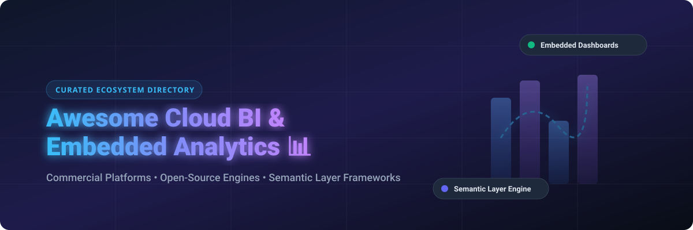

# Awesome-Cloud-Business-Intelligence-Embedded-Analytics 📊 📈

  

  
  
  
  
  
  

---

## 🌟 Top Cloud Business Intelligence & Embedded Analytics Ecosystem 🚀

**Curated Directory of Commercial BI Platforms, Open-Source Analytics Engines & Semantic Layer Frameworks**  

*Focused on Embedded Analytics, Centralized Semantic Modeling, Self-Service Visualization, White-Label Dashboards & Self-Hosted Analytics Infrastructure.*

**Last updated: October 2026** 📅

---

### 📌 Overview & SEO Summary 🔍

Welcome to the definitive, SEO-optimized awesome list of **Cloud Business Intelligence (BI) platforms**, **Open-Source Embedded Analytics engines**, and **Headless Semantic Layer frameworks**. 

Whether you are evaluating enterprise-grade commercial platforms (such as *Microsoft Power BI*, *Amazon QuickSight*, *Tableau Cloud*, and *Looker*) or searching for self-hostable open-source alternatives (like *Grafana*, *Apache Superset*, *Metabase*, *Appsmith*, and *Cube*), this repository aggregates current pricing, free tier limits, company valuations, GitHub Stars_Counts, and feature breakdowns to help data teams make informed architectural decisions.

---

## 📑 Table of Contents 📚

- [🏢 SaaS & Commercial Platforms](#-saas--commercial-platforms)
- [🔓 Open-Source GitHub Projects](#-open-source-github-projects)
- [🛠️ How to Contribute](#%EF%B8%8F-how-to-contribute)
- [📊 Star History](#-star-history)
- [🤝 Support & Sponsorship](#-support--sponsorship)
- [⚠️ Disclaimer](#%EF%B8%8F-disclaimer)

---

## 🏢 SaaS & Commercial Platforms 🏢

> 📈 **Market Size & Structure**: The global Cloud Business Intelligence (BI) & Embedded Analytics market is estimated at **$32.5 Billion in 2026** (growing at a ~15.2% CAGR toward $55B+ by 2030). The sector is **moderately fragmented**: dominated at the enterprise tier by hyperscalers (Microsoft, AWS, Google/Looker, Salesforce/Tableau) while maintaining a vibrant ecosystem of specialized cloud platforms (Sigma, ThoughtSpot) and composable open-source analytics engines.

*Sorted by Valuation / Market Cap / Revenue (Descending)* 📊

| SaaS / Commercial Platform | Company / Owner | Valuation / Market Cap / Revenue | Standard Edition Starting Price | Free Tier / Free Trial Limits | Description |
| :--- | :--- | :--- | :--- | :--- | :--- |
| **[Microsoft Power BI](https://powerbi.microsoft.com/)** 🔷 | Microsoft | ~$3.90 Trillion | **$14/user/month** (Pro edition); **$24/user/month** (Premium Per User) | **Free Desktop edition** (local modeling); **60-day free Pro trial** | Enterprise BI suite with DAX modeling, Excel integration, and Power BI Embedded via Fabric F-SKUs. |
| **[Amazon QuickSight](https://aws.amazon.com/quicksight/)** ☁️ | Amazon | ~$2.0 Trillion | **$3/month per reader** (pay-per-session); **$24/month per author** | **30-day free trial** (1 author + 1 reader, 10GB SPICE storage) | Serverless cloud-native BI with pay-per-session pricing, ML Insights, and Q natural language querying. |
| **[Looker](https://looker.com/)** 🔍 | Google (Alphabet) | ~$2.0 Trillion | **$36,000/year base platform** + **$30/user/month** (Standard viewer) | **30-day Google Cloud trial**; custom enterprise demo | Governed enterprise BI powered by LookML centralized semantic modeling and multi-tenant SDK embedding. |
| **[Tableau Cloud](https://www.tableau.com/)** 🎨 | Salesforce | ~$250 Billion | **$75/user/month** (Creator); **$15/user/month** (Viewer) | **14-day free trial** (full Creator capabilities) | Industry-standard drag-and-drop visual analytics platform with Tableau Prep and white-label embedding. |
| **[ThoughtSpot Cloud](https://www.thoughtspot.com/)** 🧠 | ThoughtSpot | ~$4.2 Billion | **$95/month** (Essentials edition starting price) | **30-day free trial** (up to 5 Million data rows) | AI-powered search-driven BI platform offering natural language querying and ThoughtSpot Embedded APIs. |
| **[Sigma Computing](https://www.sigmacomputing.com/)** 📊 | Sigma Computing | ~$1.5 Billion | **$25/user/month** (Essentials edition) | **14-day free trial** (connects to sample cloud warehouse) | Spreadsheet-style cloud BI operating directly on Snowflake, BigQuery, and Databricks with native embedding. |
| **[Sisense Fusion](https://www.sisense.com/)** 🧩 | Sisense | ~$1.1 Billion | **$833/month** ($10,000/year entry package starting price) | **14-day free trial** (pre-loaded sample dataset) | Embedded analytics platform engineered for SaaS application embedding with an in-memory engine. |
| **[Domo](https://www.domo.com/)** 🎯 | Domo Inc. | ~$1.0 Billion | **$300/month** (Standard edition starting price) | **30-day free trial** (up to 5 user seats) | Cloud business management platform featuring data pipeline integration, low-code apps, and Domo Everywhere. |
| **[GoodData Cloud](https://www.gooddata.com/)** 🏗️ | GoodData | ~$300 Million | **$200/month** (Growth edition starting price) | **30-day free trial**; free community developer tier | Composable multi-tenant analytics engine built on DuckDB, Apache Arrow, and Apache Iceberg with React SDK. |
| **[Metabase Cloud](https://www.metabase.com/)** 🎯 | Metabase | ~$300 Million | **$100/month** (Starter tier, includes first 5 users) | **Free forever open-source self-hosted edition**; **14-day Cloud trial** | User-friendly visual BI platform enabling non-technical teams to create interactive dashboards in minutes. |

---

## 🔓 Open-Source GitHub Projects 🔓

*Sorted by GitHub Stars_Count (Descending)* 🌟

- **[Grafana](https://github.com/grafana/grafana)**  📈  
  **Operational monitoring and observability leader**, AGPL-3.0 licensed. **Default dashboard for Prometheus, InfluxDB, Elasticsearch, and time-series backends**. Enterprise alerting, plugin ecosystem, and real-time operational metrics tracking.

- **[Apache Superset](https://github.com/apache/superset)**  🚀  
  **The most complete open-source BI platform**, Apache-2.0 licensed. **40+ chart types, full SQL editor, 40+ warehouse connectors via SQLAlchemy**. Features a rich dataset semantic layer, dbt manifest integration, and an embedded iframe/guest-token SDK.

- **[Metabase](https://github.com/metabase/metabase)**  🎯  
  **Most popular business-focused open-source BI**, AGPL-3.0 licensed. **Single JAR file deployment** with intuitive visual query builder allowing non-technical users to ask questions without SQL. Free static embedding with "Powered by Metabase" badge.

- **[Appsmith](https://github.com/appsmithorg/appsmith)**  🛠️  
  **Open-source low-code platform for internal tools and analytical dashboards**, Apache-2.0 licensed. Connects to SQL databases, REST APIs, and GraphQL with customizable UI widgets for building operational BI applications.

- **[ToolJet](https://github.com/ToolJet/ToolJet)**  ⚡  
  **Extensible open-source low-code internal tool builder**, AGPL-3.0 licensed. Drag-and-drop dashboard canvas, JavaScript/Python code execution, and native integrations with Snowflake, Postgres, MongoDB, and Stripe.

- **[Redash](https://github.com/getredash/redash)**  ⚠️  
  **SQL-first query and dashboard tool**, BSD-2-Clause licensed. Designed for SQL-fluent teams to write queries, create visual charts, and assemble shared dashboards. Note: Acquired by Databricks in 2020; maintenance is community-driven.

- **[Kibana](https://github.com/elastic/kibana)**  🔍  
  **Elastic Stack visualization engine**, Elastic License 2.0 / SSPL. Specialized in log analysis, security event monitoring, and real-time operational search dashboards built directly on Elasticsearch indices.

- **[Cube](https://github.com/cube-js/cube)**  🧊  
  **Headless semantic layer & data API**, Apache-2.0 licensed. Sits between data warehouses (Snowflake, BigQuery, ClickHouse) and frontend applications. Provides metric definitions, caching, multi-tenant security, and REST/GraphQL/SQL APIs for embedded analytics.

- **[ILLA Builder](https://github.com/illacloud/illa-builder)**  🎨  
  **Low-code tool builder with AI integration**, Apache-2.0 licensed. Enables developers to build business dashboards and admin panels rapidly with drag-and-drop components and automated AI workflows.

- **[Graphic Walker](https://github.com/Kanaries/graphic-walker)**  📊  
  **Embeddable visual analytics React component**, MIT licensed. Provides an interactive Tableau-like drag-and-drop data exploration UI embedded directly inside web apps, backed by DuckDB in-browser WASM processing.

- **[Lightdash](https://github.com/lightdash/lightdash)**  🔧  
  **dbt-native BI platform**, MIT licensed. Automatically transforms dbt repository metrics, dimensions, and schema definitions into an explorable self-service BI environment without re-defining data logic.

- **[Evidence](https://github.com/evidence-dev/evidence)**  📝  
  **Code-first Markdown analytics builder**, MIT licensed. Allows developers to build fast, version-controlled analytical reports and embedded dashboards using Markdown and inline SQL queries.

- **[Rill](https://github.com/rilldata/rill)**  ⚡  
  **Fast operational BI for DuckDB and ClickHouse**, Apache-2.0 licensed. Code-first data modeling and fast dashboarding tool engineered for low-latency metric exploration on local files and cloud data warehouses.

---

## 🛠️ How to Contribute 🛠️

Contributions are welcome! Follow these steps to submit new cloud BI platforms or open-source analytics software:

1. 🍴 **Fork** the repository.
2. 📝 **Add/edit** entries in `README.md` maintaining table/list structure and formatting.
3. 🔗 Include project title, official website/GitHub link, exact Stars_Count, license, and brief description.
4. 🚀 Submit a **Pull Request** with a descriptive summary of your changes.

---

## 📊 Star History 📊

---

## 🤝 Support & Sponsorship 🤝

Thank you for exploring and utilizing this **Awesome Cloud BI & Embedded Analytics** directory! 

If you find this project valuable for your team or organization, please consider supporting its continuous maintenance:

- ⭐ **Star** this repository to help increase its visibility across GitHub!
- 🔀 **Fork** and share this repository with fellow data engineers, architects, and analytics leaders.
- ☕ **Sponsor & Buy Me a Coffee**: Support ongoing open-source curation and development directly via the [GitHub Sponsor Dashboard](https://github.com/sponsors/ishandutta2007).

---

## ⚠️ Disclaimer ⚠️

- This is a **community-curated** list for informational and architectural evaluation purposes. ℹ️
- **Open source total cost of ownership**: While open-source solutions like Apache Superset or Metabase have zero license costs, running them in production requires infrastructure engineering, SSO configuration, and data operations overhead.
- **Embedded Analytics License Limits**: Always review vendor embedding rights — commercial platforms frequently separate basic user seats from white-label application embedding SKUs.

---

  <b>Made with ❤️ for data engineers, analytics leaders, and open-source BI advocates.</b>

